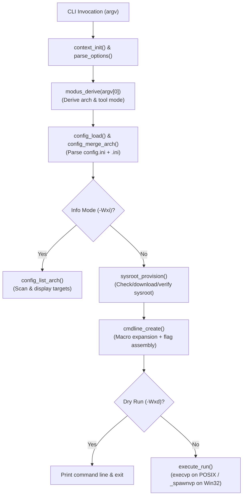

# CrossCC Roadmap & Development Plan

This document serves as the persistent project roadmap for `crosscc` (`~/focus/crosscc`). It captures the architectural design, current implementation status, lessons learned from the previous proof-of-concept iteration (`~/repos/cc`), and an actionable, step-by-step backlog designed to minimize context-switching overhead between development sprints.

---

## Quick Resume Dashboard

When resuming work after a hiatus, check this section first to determine current status and immediate next actions.

* **Current Phase**: **Phase 1: Macro & Path Expansion Engine (`expand.[hc]` & `latest.[hc]`)**
* **Immediate Next Action**:
  1. Implement `src/expand.[hc]` and `src/latest.[hc]` using `string` and `strspan_t` instead of raw pointer arithmetic.
  2. Implement unit tests in `test/expand_test.c` and `test/latest_test.c`.
* **Build & Test Command**:
  ```bash
  make clean && make test && make all
  ```

---

## Architectural Overview & Execution Pipeline

`crosscc` is a lightweight, zero-dependency, configuration-driven cross-compilation wrapper and tool dispatcher.



---

## Design Standards & Conventions

All new modules must strictly adhere to the project standards established during the rewrite:

1. **C Standard & Toolchain Quality**:
   - Strictly standard C11.
   - Clean compilation under `clang -Weverything` with zero warnings (see `-Wno-*` exclusions in [`Makefile`](file:///data/data/com.termux/files/home/focus/crosscc/Makefile)).
   - Native Windows cross-compilation verified via `make check-win-api` (`x86_64-w64-mingw32-clang -fsyntax-only`).
2. **Container & String Semantics (Convenient Containers `cc.h`)**:
   - Use `string` for dynamically owned null-terminated strings (`init`, `push_fmt`, `cleanup`).
   - Use `strspan_t` (`begin`, `end` pointers) for zero-allocation slices and token parsing.
   - Use `vec(string)` for argument lists and collections (g_ctx.passthrough).
   - Use `map(string, string)` for INI key-value storage (`g_ctx.settings`).
   - Use `set(string)` for deduplication sets (e.g. target platform scanning).
3. **Structured Logging (DevSolar/SoLog `solog.h`)**:
   - Use appropriate log levels: `TRACE` (function entry/exit, loop steps), `DEBUG` (config resolution, resolved paths), `INFO` (user operations), `WARN` (fallback/syntax issues), `ERR` (failure conditions).
   - Format strings must guard NULL pointers: `str ? str : "(null)"`.
4. **Testing Protocol (GreaTest `greatest.h`)**:
   - Every source module `src/<module>.c` must have a corresponding test suite `test/<module>_test.c`.
   - All suites must be declared and registered in [`test/crosscc_test.c`](file:///data/data/com.termux/files/home/focus/crosscc/test/crosscc_test.c).

---

## Module Status & Detailed Backlog

### Phase 0: Foundations & CLI Options (Status: COMPLETE)
- [x] **Support Libraries**: `cc.h`, `cc_include.h`, `solog.h` (v10), `greatest.h` (v1.5.0).
- [x] **Build System**: [`Makefile`](file:///data/data/com.termux/files/home/focus/crosscc/Makefile) with dependency tracking, compile commands generation, and MinGW syntax checks.
- [x] **`src/utils.[hc]`**:
  - Case-insensitive comparisons (`stricmp`, `strnicmp`, `strvicmp`).
  - Safe reverse character search (`strrpbrk`).
  - File/Directory accessibility checks (`file_readable`, `dir_readable`).
  - Whitespace trimming (`rtrim`, `rtrim_str`, `ltrim`, `ltrim_str`).
  - Continuation-aware line reader (`get_line`).
  - Tokenizing loop (`foreach`).
  - Path candidate resolver (`find_first`).
  - Full SoLog log coverage and comprehensive tests in `test/utils_test.c`.
- [x] **`src/context.[hc]`**:
  - Global `context_t g_ctx` structured with X-macro `OPTIONS(X)`.
  - Lifecycle functions `ctx_init()` and `ctx_cleanup()`.
  - Debug dump (`dump()`) and help text generator (`help()`).
  - Tests in `test/context_test.c`.
- [x] **`src/options.[hc]`**:
  - Custom option parser handling `-Wx,<opt>[=<val>]` syntax.
  - Safe, non-allocating parsers for bool (`parse_bool`), long (`parse_long`), and strings (`parse_string`).
  - Separation of CrossCC internal options from compiler passthrough arguments (`g_ctx.passthrough`).
  - Tests in `test/options_test.c`.
- [x] **Runner Connection Polish**:
  - In [`test/crosscc_test.c`](file:///data/data/com.termux/files/home/focus/crosscc/test/crosscc_test.c), added `SUITE_EXTERN( options_suite );` and `RUN_SUITE( options_suite );`.

---

### Phase 1: Macro & Path Expansion (`src/expand.[hc]` & `src/latest.[hc]`)
**Purpose**: Recursively resolve configuration placeholders (`{ENV:...}`, `{ARG:...}`, `{section.key}`, and `{LATEST}`) into concrete paths and arguments.

- [ ] **`src/expand.h` & `src/expand.c`**:
  - Port from `~/repos/cc/src/expand.[hc]`, modernizing from old `str( char )` to `string` and `strspan_t`.
  - Expand `{ENV:<var>}`: Look up environment variable, fallback to empty string if unset.
  - Expand `{ARG:<n>}`: Variable arguments passed to `expand_macro(...)` (used for template commands like download/unpack).
  - Expand `{<section>.<key>}`: Read from `g_ctx.settings` map; fallback to `getenv()` if not present in settings.
  - Two-phase resolution: Ensure all variables and settings are fully expanded *before* resolving `{LATEST}`.
  - Error and edge-case handling: Guard against unterminated `{...}` brackets and infinite recursion.
- [ ] **`src/latest.h` & `src/latest.c`**:
  - Port and modernize version-directory discovery.
  - Given a path like `-B{sysroot.dir}/../lib/gcc/{settings.id}/{LATEST}`, parse the directory prefix and filename pattern.
  - Scan target directory with `opendir`/`readdir`.
  - Compare version numbers using `utils.c:strvicmp()` to identify the highest/newest release.
  - Handle prefix flags gracefully (`-I`, `-L`, `-B`).
- [ ] **Unit Tests**:
  - Create `test/expand_test.c` (test nested macros, missing env vars, ARG indexing, fallback).
  - Create `test/latest_test.c` (test directory version sorting, missing directories, custom prefixes).
  - Add suites to `Makefile` and `test/crosscc_test.c`.

---

### Phase 2: Configuration & Target Platform Profiles (`src/config.[hc]`)
**Purpose**: Parse global and arch-specific `.ini` files, populate `g_ctx.settings`, and support listing supported targets.

- [ ] **`src/config.h` & `src/config.c`**:
  - **INI Parsing Engine**:
    - Parse `[section]` headers and `key = value` lines using `get_line()` and `strspan_t`.
    - Handle inline and full-line comments (`#`, `;`).
    - Handle quoted values (`"..."` or `'...'`) preserving spaces.
    - Store entries in `g_ctx.settings` as normalized keys (e.g. `compiler.flags`, `sysroot.dir`).
  - **`config_load()`**:
    - Check explicit configuration file if `-Wxc=<path>` is specified (`g_ctx.config`).
    - Otherwise search candidate paths:
      - Linux/macOS: `$XDG_CONFIG_HOME/crosscc/config.ini`, `$HOME/.config/crosscc/config.ini`.
      - Windows: `%APPDATA%/crosscc/config.ini`.
  - **`config_merge_arch()`**:
    - Identify target arch (from `-Wxt=<arch>` or derived via `modus_derive`).
    - Search for `<arch>.ini` in current directory and paths in `settings.inifiles`.
    - Merge architecture settings on top of base settings in `g_ctx.settings`.
  - **`config_list_arch()` (`-Wxi`)**:
    - Iterate over directories defined in `settings.inifiles` and `.`.
    - Inspect each `*.ini` file (skipping `config.ini` and `template.ini`).
    - Extract `settings.name` and `settings.description`.
    - Print formatted list of available platforms to stdout.
- [ ] **Unit Tests**:
  - Create `test/config_test.c` (test section parsing, comment stripping, quoting, key overwrite, candidate fallback).
  - Add suite to `Makefile` and `test/crosscc_test.c`.

---

### Phase 3: Mode & Architecture Derivation (`src/modus.[hc]`)
**Purpose**: Determine the compilation mode and target platform from `argv[0]` when invoked through symlinks (e.g. `aarch64-linux-musl-gcc` or `crcc`).

- [ ] **`src/modus.h` & `src/modus.c`**:
  - Strip directory paths and Windows `.exe` extension from `argv[0]`.
  - Check for `<arch>-<mode>` split (e.g. `x86_64-w64-mingw32-gcc` -> arch: `x86_64-w64-mingw32`, mode: `gcc`).
  - Check for `cr<mode>` shorthand (e.g. `crcc` -> mode: `cc`).
  - Translate tool name using `[modes]` from `g_ctx.settings` (e.g. `cc` -> `compiler-c`, `cxx` -> `compiler-cxx`, `ld` -> `linker`, `ar` -> `archiver`).
  - Coordinate with explicit CLI options:
    - If `-Wxt=...` was passed and conflicts with `argv[0]`, log error and exit.
    - If `-Wxm=...` was passed, allow it to override `argv[0]`.
- [ ] **Unit Tests**:
  - Create `test/modus_test.c` (test symlink names, path prefixes, `.exe` suffixes, CLI overrides, invalid modes).
  - Add suite to `Makefile` and `test/crosscc_test.c`.

---

### Phase 4: Sysroot Provisioning & Verification (`src/sysroot.[hc]`)
**Purpose**: Ensure cross-compiler sysroots exist locally; automate downloading, checksum verification, and extraction when absent.

- [ ] **Support Dependency**:
  - Add `src/support/lonesha256.h` (from `~/repos/cc/src/support/lonesha256.h`) to support files and update `Makefile` target.
- [ ] **`src/sysroot.h` & `src/sysroot.c`**:
  - Check if `sysroot.dir` is populated and points to a readable directory (`utils_dir_readable`).
  - If missing:
    - Expand cache directory (`settings.cache`).
    - Retrieve archive URL (`sysroot.url`) and archive filename (`sysroot.archive`).
    - If archive is not already in cache:
      - Construct download command from `settings.download` (e.g. `curl -sSL {ARG:1} -o {ARG:2}`).
      - Execute download via `system()` or process runner.
    - Verify SHA-256 checksum if `sysroot.checksum` is specified (`lonesha256_file`). Abort on mismatch.
    - Construct unpack command from `sysroot.unpack` (e.g. `tar xzf {ARG:1} -C {sysroot.base}`).
    - Execute unpack command.
    - If `sysroot.setup` hook is specified, execute setup script.
- [ ] **Unit Tests**:
  - Create `test/sysroot_test.c` (test existing dir bypass, checksum validation logic, command formatting).
  - Add suite to `Makefile` and `test/crosscc_test.c`.

---

### Phase 5: Command Line Assembly (`src/cmdline.[hc]`)
**Purpose**: Assemble the complete vector of compiler arguments and environment variables for the final command execution.

- [ ] **`src/cmdline.h` & `src/cmdline.c`**:
  - **Tool Binary Resolution**:
    - Read candidate string from `<mode>.binary` (e.g. `{settings.id}-gcc;clang;gcc`).
    - Expand macros and split by `;`.
    - Resolve the first executable existing in `PATH` or filesystem via `utils_find_first()`.
  - **Flag Concatenation Order**:
    1. Runner tool and runner flags (if mode is `runner` or mode has runner configured).
    2. Tool binary resolved above.
    3. Supermode flags (e.g. `compiler.flags`).
    4. Mode-specific flags (e.g. `compiler-c.flags`).
    5. Optimization flags (`release`, `debug`, `size`, `speed` mapped from `-Wxo=...` or `-Wxb=...`).
    6. Sanitizer flags (`sanitize` from `-Wxs`).
    7. Profiler flags (`profile` from `-Wxp`).
    8. Linkage flags (`static` or `shared` from `-Wxl=...`).
    9. Passthrough flags from user invocation (`g_ctx.passthrough`).
    10. Post flags (`supermode.post_flags`, `mode.post_flags`).
  - **Environment Variables**:
    - Apply environment assignments from `supermode.env` and `mode.env` via `setenv` (POSIX) or `_putenv_s` (Win32).
- [ ] **Unit Tests**:
  - Create `test/cmdline_test.c` (verify exact argument order, flag injection, passthrough preservation, env var formatting).
  - Add suite to `Makefile` and `test/crosscc_test.c`.

---

### Phase 6: Process Execution (`src/execute.[hc]`)
**Purpose**: Execute the assembled command line or print it in dryrun mode.

- [ ] **`src/execute.h` & `src/execute.c`**:
  - **Dryrun Handling (`-Wxd`)**:
    - If `g_ctx.dryrun` is true, print formatted command line to stdout, log info message, and return `EXIT_SUCCESS`.
  - **POSIX Execution**:
    - Convert `vec(string)` to `char * argv[]`.
    - `fork()` and `execvp(argv[0], argv)`.
    - `waitpid()` to capture child process status, returning exact exit code or signal status.
  - **Windows Execution**:
    - Use `_spawnvp(_P_WAIT, argv[0], (char const * const *)argv)` with Windows error checking.
  - Proper memory cleanup of the temporary `argv` array.
- [ ] **Unit Tests**:
  - Create `test/execute_test.c` (test dryrun intercept, basic binary execution, error code return).
  - Add suite to `Makefile` and `test/crosscc_test.c`.

---

### Phase 7: Application Integration (`crosscc.c`)
**Purpose**: Tie all phases together into the final production executable.

- [ ] Update [`crosscc.c`](file:///data/data/com.termux/files/home/focus/crosscc/crosscc.c) `main()`:
  - Initialize context (`ctx_init`).
  - Parse CLI arguments (`parse_options`).
  - Set `solog_config.level` according to `-Wxv` or debug build defaults.
  - If `-Wxh` requested: display help (`help()`) and exit.
  - Load global configuration (`config_load`).
  - Derive mode and architecture (`modus_derive`).
  - If `-Wxi` requested: list target architectures (`config_list_arch`) and exit.
  - Merge architecture configuration (`config_merge_arch`).
  - Ensure sysroot is provisioned (`sysroot_provision`).
  - Assemble command line (`cmdline_create`).
  - Execute command (`execute_run`).
  - Clean up context (`ctx_cleanup`) and exit with captured exit code.

---

### Phase 8: Production Polish & Documentation
- [ ] **INI Templates**: Verify `ini/config.ini`, `ini/aarch64.ini`, and create additional common target profiles (`x86_64-linux-musl.ini`, `x86_64-w64-mingw32.ini`, `armv7l-linux-musleabihf.ini`).
- [ ] **Installation Target**: Add `make install` to Makefile targeting `/usr/local` or `$HOME/.local`.
- [ ] **Documentation**: Write comprehensive `README.md` covering:
  - Motivation and feature set.
  - Configuration structure (`config.ini` vs `<arch>.ini`).
  - Symlink setup tutorial (`ln -s crosscc aarch64-linux-musl-gcc`).
  - Command line reference table for `-Wx,...` options.
